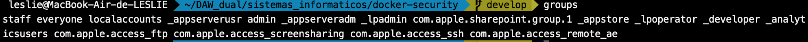
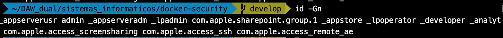
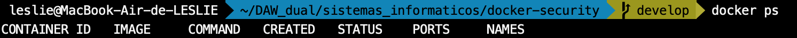

#Docker Security

>This is activity is proposed by @maximofernandezriera, teacher of Informatics System at DAW dual. As I'm using a MacOS, some commands are different from those in the statment. But don't worry, I have written it down in this README

##Statment:

Following this [guide](statment.md) do all the steps and then resolve the challenege proposed.

## Solution:

First of all, on your console, type the following command in order to look at the users in the group using

```shell
$ groups
```


or 
```powershell
id -Gn
```

To add  a group for docker

Then check the permissions

```shell
$ docker ps
```


If we can't acces, so we enable de permission with the next command: *(this is only possible with linux sytem. On MacOs this command doesn't exist. Because, as I finf on [stackoverflow](https://stackoverflow.com/questions/70369278/how-to-add-the-current-user-to-the-docker-group-on-macos), On macOS, and using docker-machine,  is unnecessary.*

```bash
$ sudo usermod -aG docker leslie
```

We check that we can access now:

```bash
$ docker ps
```



---

### Json daemon

Now we will create a json in debug false mode as follows. To do that:
1. Create a `daemon.json`file with our prefered editor. It could be vim ,as the example, or nano.
   
    >*Note*: I'm resolving this exercise with an MacOS and the zsh terminal, and this steps are not necesarry. But in case you have a linux o windows systemI would recommand you to do it.

```shell
vim /etc/docker/daemon.json
```

1. Edit and put this inside the file.

```JSON
{
    "debug":false
}
```